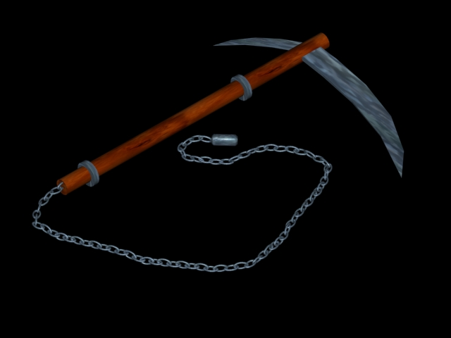

# 3D models of Ninja weapons and tools

These 3D models of Ninja weapons and tools were created by [Stefan Imhoff](https://stefanimhoff.de) in 2000 for the martial arts website [kogakure.de](https://kogakure.de). The models were converted to the `stl` format and can be viewed directly in GitHub.

## Contents

This repository contains `stl` 3d model data and rendered images of more than 80 Ninja weapons and tools. Most of the models are still in use on the current website, but are rendered in a different style.

## Licence

The models and images are provided under a licence of [Creative Commons Attribution-NonCommercial 3.0 Unported](http://creativecommons.org/licenses/by-nc/3.0/) (CC BY-NC 3.0).
